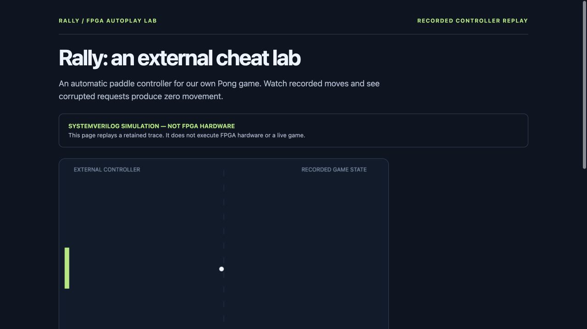
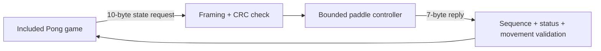

# Rally FPGA

### An external cheat for a game we control

Rally automatically moves the paddle in an included Pong game. The game sends its
state to a separate controller and accepts a small, checked movement in return.
Use the Python reference, actual SystemVerilog simulation, or a separately verified
UART device. The selected backend is always visible.



**Show it:** download or clone this repository and open **[docs/demo.html](docs/demo.html)**
in a browser. It is a self-contained replay of 1,000 actual RTL-backed game frames.
Use Pause, the frame slider and speed control to inspect movement and rejected requests.
GitHub shows the HTML source; download it to run it. No server or FPGA is needed for the replay.

## Run it yourself

```sh
python3 rally.py --backend model --headless 1000 --fault-every 23
python3 replay.py --trace out/rally.jsonl --output out/rally-replay.html
```

For live play, install Tk (`brew install python-tk@3.14` for Homebrew Python 3.14;
match your Python version), then run `python3 rally.py --backend model`. Space toggles
auto-play; Escape closes the window. For actual HDL execution, install Icarus Verilog
and use `--backend rtl`. It fails explicitly if the simulator is unavailable.

The sandbox-cheat framing describes the demo accurately. Supporting another game
requires an explicit adapter for its state and control interface; there is no universal
"any game" compatibility or claim of invisibility.

## How it works



- Valid positions: 0–1023. Deadband: two pixels. Movement: at most eight pixels per update.
- A bad CRC, stale sequence, invalid response or timeout produces zero movement.
- Sequence numbers wrap after 65,536 updates; CRC detects errors and is not authentication.
- Only one request may be outstanding. Incoming bytes during a pending reply are discarded.
- Host round-trip measurements include Python, scheduling and transport overhead; they are not FPGA latency.

Read the [wire protocol](docs/PROTOCOL.md) and [two-minute demo guide](docs/SHOWCASE.md).

## Current local evidence

| Check | Result |
| --- | --- |
| Python suite | 10 test methods passed |
| Controller RTL | 1,170 transactions, corruption, recovery and reply stalls |
| UART component | All 256 byte values plus invalid-stop rejection |
| Actual board wrapper in simulation | 32 requests at the default UART divisor, independent reply sampler, corrupted CRC, framing recovery and partial-frame expiry |
| Game replay | 1,000 model and 1,000 RTL frames; identical game states; 43 corrupt requests rejected per backend |
| Generic synthesis | `rally_framer`, `uart_rx`, `uart_tx` passed |

## Physical UART

The [AS02MC04 board procedure](board/README.md) covers the candidate wrapper and
constraints. Identify the actual part, pinout, voltage, power and cooling before building
or connecting hardware. The simulation uses behavioral clock-buffer models and does not
validate board electrical behavior.

After independent board bring-up, install `pyserial==3.5` and run:

```sh
python3 rally.py --backend serial --port YOUR_SERIAL_DEVICE
```

## Verification you can reproduce

```sh
python3 -m unittest -v       # Python only
python3 sim/check_rtl.py     # Actual Icarus Verilog simulation
python3 verify.py            # Python + integrated RTL + demos + generic synthesis
```

Python 3.10+ and Git are required. The reference demo has no third-party Python dependencies.
Install Icarus Verilog (`iverilog` and `vvp`) for RTL. On macOS:

```sh
brew install icarus-verilog
python3 -m venv .venv
. .venv/bin/activate
python3 -m pip install yowasp-yosys==0.69.0.0.post1233
python3 verify.py
```

The verifier accepts native `yosys`, [YoWASP Yosys](https://yowasp.org/), or an explicit
`YOSYS=/path/to/executable`. It saves logs, tool versions and source SHA-256 hashes under
`out/verification/`. Missing tools or failed commands produce a failing exit status and
manifest. [Generic synthesis](https://yosyshq.readthedocs.io/projects/yosys/en/v0.65/using_yosys/synthesis/synth.html)
checks the logic structure; it does not establish device utilization, clock frequency,
routed timing or electrical operation.

The [retained local verification](evidence/local-verification/results.json) records the
showcase checks. Earlier files in `evidence/` describe the original publication baseline.
The [GitHub workflow](.github/workflows/verify.yml) runs the same verifier, but hosted
Actions were blocked before execution by account billing/spending limits during the
local audit. That is separate from the passing local results.

## What remains outside this release

No physical FPGA board, placed-and-routed design, timing closure, or measured hardware
latency is certified. These are demonstrable software and RTL projects. See the
[verification contract](docs/VERIFICATION.md) for coverage and remaining boundaries.

## License and attribution

MIT. See [LICENSE](LICENSE) and [PROVENANCE.md](PROVENANCE.md).
