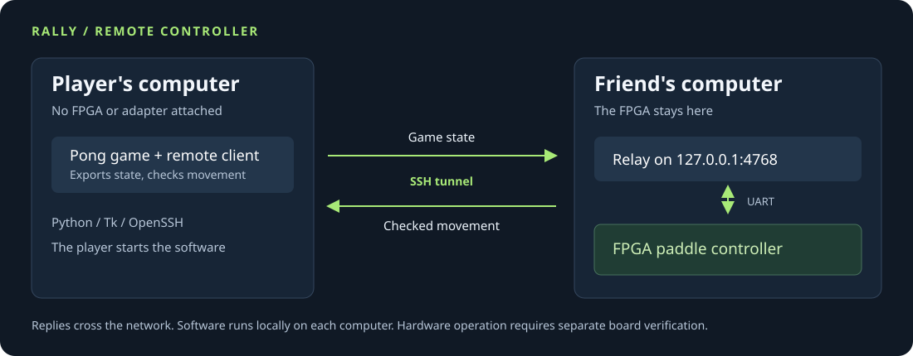

# Rally FPGA

A remote cheat controller for the included Pong game, hosted on a friend's machine.

You run the included Pong game on your computer. Your friend runs a relay and connects
the FPGA to their computer. Rally sends the ball and paddle positions over an SSH tunnel;
the FPGA returns a bounded paddle movement. Your computer needs a network connection
and the Rally client, with no FPGA, USB adapter or other peripheral attached.



[Setup guide](docs/REMOTE.md) · [Protocol](docs/PROTOCOL.md) · [Demo guide](docs/SHOWCASE.md) · [Verification](docs/VERIFICATION.md)

## What runs where

| Player's computer | Friend's computer |
| --- | --- |
| Pong game and remote client | Relay process |
| Python and Tk for the game window | Python and pyserial for UART |
| OpenSSH client | SSH access configured by the friend |
| Network connection | FPGA, UART adapter, board power and cooling |

The relay sends controller responses. It does not broadcast executable software or
install anything on the player's device. The player starts the client themselves.
One player can use a relay at a time.

## Try the connection without a board

Clone or download this repository, then open two terminals in its directory.

In the first terminal:

```sh
python3 relay.py --backend model
```

In the second:

```sh
python3 rally.py --backend remote --expect-backend model
```

The window identifies the remote Python model. Space toggles assistance; Escape closes
the game. This checks the network path on one computer. Use `--backend rtl` on the relay
and `--expect-backend rtl` on the client to run compiled SystemVerilog instead.

Python 3.10 or later is required. The window also needs Tk. For Homebrew Python 3.14,
install it with `brew install python-tk@3.14`; use the matching Tk package for other
Python versions. Headless runs do not need Tk:

```sh
python3 rally.py --backend remote --expect-backend model --headless 1000 --fault-every 23
```

## Use your friend's FPGA

First complete the [board bring-up procedure](board/README.md). Then follow these steps
on the indicated machine. Replace the uppercase placeholders with the actual device,
SSH account and host. The friend must already allow your SSH account to connect.

### 1. Friend: start the relay

```sh
python3 -m pip install pyserial==3.5
python3 relay.py --backend serial --port YOUR_UART_DEVICE
```

The relay listens on `127.0.0.1:4768` on the friend's machine. The FPGA is attached there.

### 2. Player: open the tunnel

```sh
ssh -N -T -o ExitOnForwardFailure=yes -o ServerAliveInterval=15 -o ServerAliveCountMax=3 \
  -L 127.0.0.1:4768:127.0.0.1:4768 FRIEND_USER@FRIEND_HOST
```

Leave that terminal open. [OpenSSH local forwarding](https://man.openbsd.org/ssh#L)
connects your local port to the relay through the authenticated SSH connection. Verify
the friend's host key when connecting for the first time.

### 3. Player: start the game

```sh
python3 rally.py --backend remote --expect-backend serial
```

The client checks that the relay reports a UART backend. Your friend still needs to
verify which board and bitstream are attached. See the [setup guide](docs/REMOTE.md)
for changing ports, diagnosing timeouts and stopping the session.

## Watch a recorded run

Download [docs/demo.html](docs/demo.html) and open it in a browser. It contains a replay
of 1,000 frames sent through a separate relay process running actual RTL. The retained
run used two processes on one computer; it did not use a physical FPGA or an internet
connection. GitHub displays the HTML source, so download the file to play it.


## Control and failure behavior

Rally accepts positions from 0 through 1023, uses a two-pixel deadband and limits each
movement to eight pixels. The client checks the reply's CRC, sequence, status and bounds.
Rejected requests produce zero movement. A network timeout or malformed reply closes
the connection so a late response cannot move the paddle on a later frame. Restart the
client to reconnect; it never switches to a local controller automatically.

Remote mode waits for one reply per game update. Network delay therefore reduces the
update rate. The default transaction deadline is 250 ms and can be set with
`--remote-timeout`. This is a Pong controller with a remote transport, not a universal
adapter for arbitrary games. Another game needs its own supported state and control
interface. Nothing here establishes anti-cheat invisibility.

## Run the checks

```sh
python3 -m unittest -v       # Reference model, socket transport and replay tests
python3 sim/check_rtl.py    # Actual RTL and board-wrapper simulation
python3 sim/check_remote.py # Separate relay/client processes, model and RTL
python3 verify.py           # All checks, demos and generic synthesis
```

For the full verifier, install Icarus Verilog and Yosys. A macOS setup is:

```sh
brew install icarus-verilog
python3 -m venv .venv
. .venv/bin/activate
python3 -m pip install yowasp-yosys==0.69.0.0.post1233
python3 verify.py
```

The verifier accepts native `yosys`, [YoWASP Yosys](https://yowasp.org/), or an explicit
`YOSYS=/path/to/executable`. It writes fresh logs and source hashes to `out/verification/`.

| Local check | Coverage |
| --- | --- |
| Python | 20 test methods, including real sockets and failure handling |
| Controller RTL | 1,170 transactions, corruption, recovery and reply stalls |
| UART | 256 byte values and invalid-stop rejection |
| Board wrapper in simulation | 32 requests at the default UART divisor, CRC and framing recovery |
| Remote relay | 1,000 model and 1,000 RTL frames; each matches its direct run and rejects 43 corrupt requests |
| Generic synthesis | Framer, UART receiver and UART transmitter |

The [retained network verification](evidence/remote-verification/results.json) records
the exact source hashes. [Earlier evidence](evidence/local-verification/results.json)
remains available for the previous revision. Hosted GitHub Actions were blocked by
account billing during verification; the local checks run independently.

Physical-board operation, two-computer SSH use, internet latency and routed timing still
need testing in that environment. The [verification guide](docs/VERIFICATION.md) separates
those checks from the passing software and simulator results.

## License and source

MIT. [LICENSE](LICENSE) and [PROVENANCE.md](PROVENANCE.md) retain the source credits.
